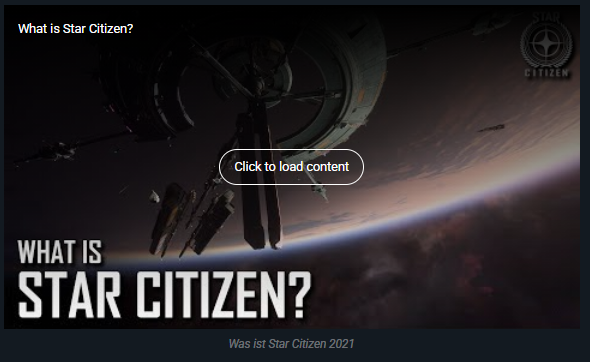

# About



The EmbedVideo Extension is a MediaWiki extension which adds a parser function called `#ev` and various parser tags like `<youtube>` for embedding video clips from various video sharing services.  
It also adds video and audio media handlers to support transforming standard `[[File:Example.mp4]]` file links into embedded HTML5 `<video>` and `<audio>` tags.

This privacy enhanced fork adds a toggleable setting that only loads external content _after_ the user gave explicit consent by clicking the video.  
Do note that thumbnails are still fetched from the respective service, which results in a connection to an external url. This behaviour can be disabled by setting `$wgEmbedVideoFetchExternalThumbnails` to `false`.


Issues, bug reports, and feature requests may be created at the issue tracker:

https://github.com/StarCitizenWiki/mediawiki-extensions-EmbedVideo/issues

The original MediaWiki extension page is located at:

https://www.mediawiki.org/wiki/Extension:EmbedVideo

## History

Large parts of the codebase are taken from [Extension:EmbedVideo v2.9.0](https://gitlab.com/hydrawiki/extensions/EmbedVideo/-/releases/v2.9.0).

# License

EmbedVideo is released under the MIT license

http://www.opensource.org/licenses/mit-license.php

See LICENSE for more details

# Installation

## Download

There are three places to download the EmbedVideo extension. The first is directly from its GitHub project page, where active development takes place.  If you have git, you can use this incantation to check out a read-only copy of the extension source:

```
git clone https://github.com/StarCitizenWiki/mediawiki-extensions-EmbedVideo.git
```

Downloadable archive packages for numbered releases will also be available from the github project page.

## Installation Instructions

1. Download the contents of the extension, as outlined above.
2. Create an EmbedVideo folder in the extensions/ folder of your MediaWiki installation.
3. Copy the contents of this distribution into that folder

Add the following line to your LocalSettings.php:

```php
wfLoadExtension("EmbedVideo");
```

# Usage

## Media Handler
For locally uploaded content the process for displaying it on a page is the same as an image.  [See the image syntax documentation](https://www.mediawiki.org/wiki/Help:Images#Syntax) on MediaWiki.org for complete reference on this feature.

This example would display a video in page using a HTML5 `<video>` tag.

	[[File:Example.mp4]]

To specify the start and end timestamps in the media use the start and end parameters.  The timestamp can be formatted as one of: ss, :ss, mm:ss, hh:mm:ss, or dd:hh:mm:ss.

	[[File:Example.mp4|start=2|end=6]]

Additionally a cover image can be set for video files by specifying a `cover=` key.

	[[File:Example.mp4|start=2|end=6|cover=File:LocalFile.png]]

### Example
  
Example of a local file with a custom cover image.

### Available options
The following options are available when using the media handler for local files.  
Options are added to the wikitext like `|cover=File:...` or `|start=2`.

* loop
  * Loops the audio / video
* autoplay
  * Automatically plays the file
* nocontrols
  * Disables the control elements

Options only available for video files:
* cover
  * Sets a local image file as the cover of the video
* muted
  * Mutes the audio track of the video (required for autoplay)
* gif
  * Special option that sets autoplay, muted, loop and nocontrols
	e.g. makes the video behave like a gif

## Tags

The EmbedVideo parser function expects to be called in any of the following ways:

### \#ev - Classic Parser Tag

* `{{#ev:service|id}}`
* `{{#ev:service|id|dimensions}}`
* `{{#ev:service|id|dimensions|alignment}}`
* `{{#ev:service|id|dimensions|alignment|description}}`
* `{{#ev:service|id|dimensions|alignment|description|container}}`
* `{{#ev:service|id|dimensions|alignment|description|container|urlargs}}`
* `{{#ev:service|id|dimensions|alignment|description|container|urlargs|autoresize}}`

However, if needed optional arguments may be left blank by not putting anything between the pipes:

* `{{#ev:service|id|||description}}`

## Examples

### Example #1

For example, a video from YouTube use the 'youtube' service selector enter the raw ID:

    {{#ev:youtube|pSsYTj9kCHE}}

Or the full URL:

    {{#ev:youtube|https://www.youtube.com/watch?v=pSsYTj9kCHE}}

### Example #2

To display the same video as a right aligned large thumbnail with a description:

    {{#ev:youtube|https://www.youtube.com/watch?v=pSsYTj9kCHE|1000|right|Let eet GO|frame}}

For YouTube to have the video start at a specific time code utilize the urlargs(URL arguments) parameter. Take the rest of the URL arguments from the custom URL and place them into the urlargs. Please note that not all video services support extra URL arguments or may have different keys for their URL arguments.

    https://www.youtube.com/watch?v=pSsYTj9kCHE&start=76

    {{#ev:youtube|https://www.youtube.com/watch?v=pSsYTj9kCHE|||||start=76}}

### Example #3

Creating a video list for Youtube. This allows you to queue a set of video in a temporary playlist. Use the 'youtubevideolist` service selector:

    {{#ev:youtubevideolist|-D--GWwca0g|||||playlist=afpRzcAAZVM,gMEHZPZTAVc,lom_plwy9iA,BSWYMQEQhEo,EREaWhXj4_Q}}

### Example #4
Using the service name as a parser tag

    <youtube>https://www.youtube.com/watch?v=eAORm-8b1Eg</youtube>

## Supported Services

As of version 3.x, EmbedVideo supports embedding video content from the following services:

| Site                                                     | Service Name(s)                                                                       | ID Example                                                                            | URL Example(s)                                                                                                 |
|----------------------------------------------------------|---------------------------------------------------------------------------------------|---------------------------------------------------------------------------------------|----------------------------------------------------------------------------------------------------------------|
| [Archive.org Videos](https://archive.org/details/movies) | `archiveorg`                                                                          | electricsheep-flock-244-80000-6                                                       | https://archive.org/details/electricsheep-flock-244-80000-6<br/>https://archive.org/embed/electricsheep-flock-244-80000-6 |
| [SoundCloud](http://soundcloud.com/)                     | `soundcloud`                                                                          |                                                                                       | https://soundcloud.com/skrillex/skrillex-rick-ross-purple-lamborghini                                          |
| [Spotify](http://spotify.com/)                           | `spotifyalbum` - Album embed                                                          | 1EoDsNmgTLtmwe1BDAVxV5                                                                | https://open.spotify.com/album/1EoDsNmgTLtmwe1BDAVxV5                                                          |
| [Spotify](http://spotify.com/)                           | `spotifyartist` - Artist embed                                                        | 06HL4z0CvFAxyc27GXpf02                                                                | https://open.spotify.com/artist/06HL4z0CvFAxyc27GXpf02                                                         |
| [Spotify](http://spotify.com/)                           | `spotifytrack` - Song embed                                                           | 72jCZdH0Lhg93z6Z4hBjgj                                                                | https://open.spotify.com/track/72jCZdH0Lhg93z6Z4hBjgj                                                          |
| [Twitch](http://www.twitch.tv)                           | `twitch` - Live Streams                                                               | `twitchvod` - Archived Videos on Demand                                               | twitchplayspokemon                                                                                             |
| [Vimeo](http://www.vimeo.com)                            | `vimeo`                                                                               | 105035718                                                                             | http://vimeo.com/105035718                                                                                     |
| [YouTube](http://www.youtube.com/)                       | `youtube` - Single Videos                                                             | pSsYTj9kCHE                                                                           | https://www.youtube.com/watch?v=pSsYTj9kCHE                                                                    |
| [YouTube](http://www.youtube.com/)                       | `youtubeplaylist` - Playlists                                                         | PLY0KbDiiFYeNgQkjujixr7qD-FS8qecoP                                                    | https://www.youtube.com/embed/?listType=playlist&list=PLY0KbDiiFYeNgQkjujixr7qD-FS8qecoP                       |
| [YouTube](http://www.youtube.com/)                       | `youtubevideolist` - Video List                                                       | pSsYTj9kCHE - urlargs=playlist=pSsYTj9kCHE,pSsYTj9kCHE                                | https://www.youtube.com/embed/pSsYTj9kCHE?playlist=pSsYTj9kCHE,pSsYTj9kCHE                                     |

# Configuration Settings

| Variable                             | Default Value    | Description                                                                                                                                             |
|--------------------------------------|------------------|---------------------------------------------------------------------------------------------------------------------------------------------------------|
| $wgEmbedVideoAddFileExtensions       | true             | Boolean - Enable or disable adding video/audio file extensions to the list of allowable files to be uploaded.                                           |
| $wgEmbedVideoEnableVideoHandler      | true             | Boolean - Enable or disable the video media handlers for displaying embedded video in articles.                                                         |
| $wgEmbedVideoEnableAudioHandler      | true             | Boolean - Enable or disable the audio media handlers for displaying embedded audio in articles.                                                         |
| $wgEmbedVideoDefaultWidth            | 320              | Integer - Globally override the default width of video players. When not set this uses the video service's default width which is typically 640 pixels. |
| $wgEmbedVideoMinWidth                | null             | Integer - Minimum width of video players. Widths specified below this value will be automatically bounded to it.                                        |
| $wgEmbedVideoMaxWidth                | null             | Integer - Maximum width of video players. Widths specified above this value will be automatically bounded to it.                                        |
| $wgFFprobeLocation                   | /usr/bin/ffprobe | String - Set the location of the ffprobe binary.                                                                                                        |
| $wgEmbedVideoEnabledServices         | null             | Array - Array of service names that are allowed, if empty all services are available.                                                                   |
| $wgEmbedVideoRequireConsent          | true             | Boolean - Set to true to _only_ load the iframe if the user clicks it.                                                                                  |
| $wgEmbedVideoFetchExternalThumbnails | true             | Boolean - Set to false to disable fetching video thumbnails from the external video provider. Currently only works for YouTube and Vimeo.               |

# Credits

The original version of EmbedVideo was written by Jim R. Wilson.  Additional major upgrades made by Andrew Whitworth, Alexia E. Smith, and other contributors.

See CREDITS for details
